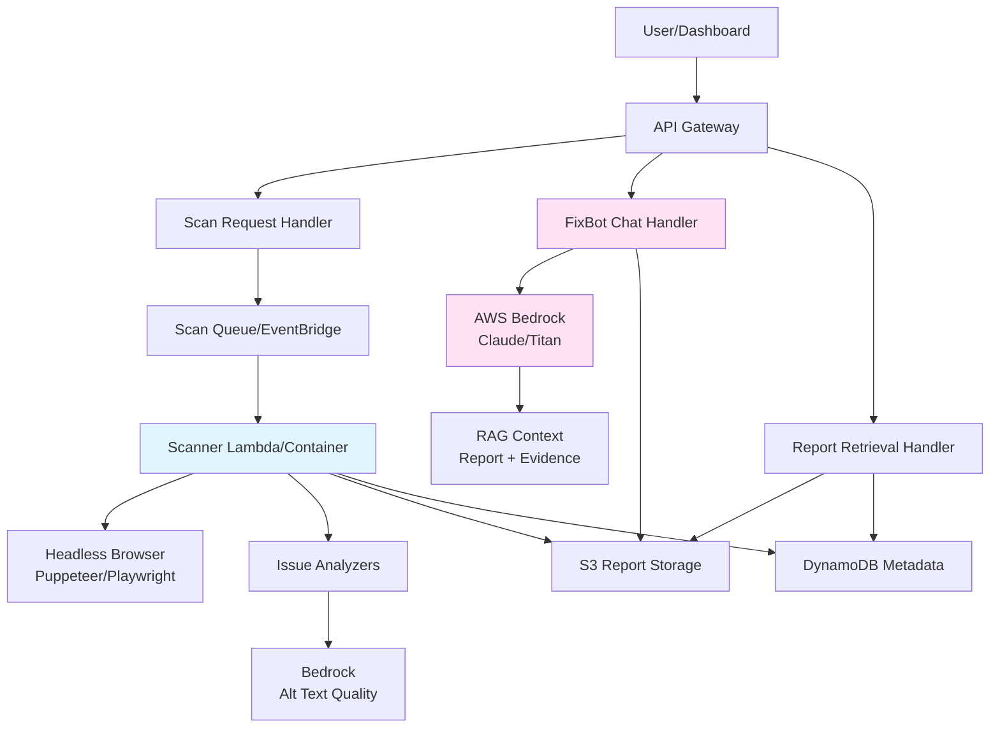

# Design Document: FixBot Accessibility Scanner

## Overview

The FixBot Accessibility Scanner is an AWS-based system that scans webpages for accessibility and content quality issues, then presents results through an engaging chat interface. The system consists of four main components:

1. **Scanner Service**: Headless browser-based analyzer that detects accessibility issues
2. **Storage Layer**: S3 + DynamoDB for reports and metadata
3. **API Layer**: REST endpoints for scan operations and FixBot chat
4. **FixBot Chat**: AI-powered assistant with strict evidence grounding and CMS awareness

The design prioritizes FixBot as the premier user-facing feature, making accessibility remediation engaging and approachable for non-technical users.

### Key Design Principles

- **Evidence-First**: All FixBot responses must cite specific issues from scanned reports
- **CMS-Aware**: Tailor remediation guidance to detected platforms (WordPress, Drupal, Umbraco)
- **Engaging UX**: Make accessibility compliance feel achievable and even fun
- **Deterministic**: Same page should produce consistent scores across scans
- **Scalable**: Serverless architecture handles batch scans efficiently

## Architecture

### System Components



### Data Flow

#### Scan Flow
1. User submits URL(s) via Dashboard → API Gateway
2. API validates URLs and publishes to scan queue
3. Scanner Lambda/Container:
   - Fetches page with headless browser
   - Runs issue analyzers (alt text, headings, links, forms, content quality)
   - Detects CMS using heuristics
   - Calculates scores using weighted deduction model
   - Generates report JSON
4. Report stored in S3, metadata indexed in DynamoDB
5. Dashboard polls or receives notification of completion

#### FixBot Chat Flow
1. User opens FixBot from report detail view
2. Dashboard loads report from S3 and passes to chat interface
3. User sends message → API Gateway → Chat Handler
4. Chat Handler:
   - Retrieves report context (if not in request)
   - Constructs RAG prompt with report + evidence + grounding rules
   - Calls Bedrock with system prompt enforcing evidence grounding
   - Validates response contains citations
5. Response returned to user with conversational, CMS-aware guidance

## Components and Interfaces

### Scanner Service

**Responsibilities:**
- Fetch and render webpages using headless browser
- Execute issue detection analyzers
- Detect CMS platform and confidence
- Calculate scores and generate reports
- Store results in S3 and DynamoDB

**Key Interfaces:**

```typescript
interface ScanRequest {
  urls: string[];
  requestId: string;
  options?: {
    timeout?: number;
    userAgent?: string;
  };
}

interface ScanResult {
  scanId: string;
  url: string;
  status: 'success' | 'failed';
  report?: Report;
  error?: ErrorDetails;
}
```

**Issue Analyzers:**

Each analyzer implements a common interface:

```typescript
interface IssueAnalyzer {
  name: string;
  category: 'accessibility' | 'content-quality' | 'structure';
  
  analyze(page: Page, dom: Document): Promise<Issue[]>;
}
```

Implemented analyzers:
- `AltTextAnalyzer`: Detects missing/low-quality alt text (uses Bedrock for quality)
- `HeadingAnalyzer`: Checks heading hierarchy and structure
- `LinkTextAnalyzer`: Identifies poor link text and duplicates
- `FormLabelAnalyzer`: Detects unlabeled form inputs
- `ContentQualityAnalyzer`: Flags walls of text and vague headings
- `ContrastAnalyzer` (stretch): Calculates color contrast ratios
- `AriaAnalyzer` (stretch): Detects ARIA misuse patterns
- `ReadabilityAnalyzer` (stretch): Calculates Flesch Reading Ease

**CMS Detection:**

```typescript
interface CMSDetector {
  detect(page: Page, dom: Document): CMSInfo;
}

interface CMSInfo {
  platform: 'wordpress' | 'drupal' | 'umbraco' | 'unknown';
  confidence: 'high' | 'medium' | 'low' | 'none';
  version?: string;
  editor?: 'gutenberg' | 'classic' | 'unknown'; // WordPress-specific
}
```

Detection heuristics:
- Check meta tags: `<meta name="generator" content="WordPress 6.x">`
- Check DOM patterns: `.wp-block-*`, `#drupal-*`, `.umbraco-*`
- Check script sources: `/wp-includes/`, `/sites/all/modules/`
- Check HTTP headers: `X-Powered-By`, `X-Generator`

**Scoring Model:**

```typescript
interface ScoringModel {
  calculateScore(issues: Issue[]): ScoreBreakdown;
}

interface ScoreBreakdown {
  overall: number; // 0-100
  categories: {
    accessibility: number;
    contentQuality: number;
    structure: number;
  };
  deductions: Deduction[];
}

interface Deduction {
  issueId: string;
  severity: 'critical' | 'high' | 'moderate' | 'low';
  points: number;
}
```

Scoring algorithm:
- Start at 100 points
- Apply weighted deductions per issue:
  - Critical: -10 points
  - High: -5 points
  - Moderate: -2 points
  - Low: -0.5 points
- Floor at 0
- Category scores calculated independently using same logic

### Storage Layer

**S3 Structure:**

```
fixbot-reports/
  {url_hash}/
    {timestamp}.json          # Full report
    {timestamp}_metadata.json # Quick metadata for listing
```

**DynamoDB Schema:**

Table: `ScanMetadata`
- Partition Key: `scanId` (UUID)
- Sort Key: `timestamp` (ISO 8601)
- Attributes:
  - `url` (string)
  - `overallScore` (number)
  - `cms` (string)
  - `cmsConfidence` (string)
  - `s3Key` (string)
  - `status` (string)
  - `errorMessage` (string, optional)
  - `issueCount` (number)
  - `criticalCount` (number)

GSI: `UrlIndex`
- Partition Key: `url`
- Sort Key: `timestamp`
- Enables querying scan history by URL

### API Layer

**Endpoints:**

```
POST /scans
  Body: { urls: string[] }
  Response: { requestId: string, scanIds: string[] }

GET /scans
  Query: ?limit=20&nextToken=xxx
  Response: { scans: ScanMetadata[], nextToken?: string }

GET /scans/{scanId}
  Response: Report (full JSON from S3)

POST /chat
  Body: { scanId: string, message: string, conversationHistory?: Message[] }
  Response: { response: string, citations: Citation[] }

GET /recurring-issues
  Query: ?minCount=2
  Response: { issues: RecurringIssue[] }
```

**Authentication/Authorization:**

For MVP: API key or simple token-based auth
For production: Cognito user pools with JWT tokens

### FixBot Chat Component

**Core Responsibilities:**
- Load report context for grounding
- Construct RAG prompts with evidence
- Enforce strict grounding rules via system prompts
- Provide CMS-specific remediation guidance
- Maintain engaging, encouraging tone

**System Prompt Structure:**

```
You are FixBot, a friendly accessibility assistant helping users fix issues on their website.

STRICT RULES:
1. You can ONLY discuss issues found in the provided scan report
2. You MUST cite specific issue IDs and evidence when answering
3. You MUST refuse questions about content not in the report
4. You MUST NOT speculate or make up information

PERSONALITY:
- Be warm, conversational, and encouraging
- Make accessibility feel approachable, not intimidating
- Celebrate user progress and small wins
- Break down complex issues into simple steps
- Use analogies and relatable examples

CMS AWARENESS:
- Detected CMS: {cms}
- Confidence: {confidence}
- Tailor instructions to this platform when confidence is medium or higher
- Provide clear navigation paths (e.g., "Click Pages → Edit → Block Settings")

REPORT CONTEXT:
{report_json}

USER QUESTION:
{user_message}
```

**RAG Context Construction:**

```typescript
interface RAGContext {
  report: Report;
  relevantIssues: Issue[]; // Filtered by semantic similarity to question
  cms: CMSInfo;
  conversationHistory: Message[];
}

function constructPrompt(context: RAGContext, userMessage: string): string {
  // 1. Build system prompt with grounding rules
  // 2. Include CMS info for tailored guidance
  // 3. Add relevant issues as context (limit to top 5 by relevance)
  // 4. Include conversation history (last 5 messages)
  // 5. Add user message
}
```

**Response Validation:**

```typescript
interface ResponseValidator {
  validate(response: string, report: Report): ValidationResult;
}

interface ValidationResult {
  valid: boolean;
  hasCitations: boolean;
  citedIssues: string[]; // Issue IDs mentioned
  warnings: string[]; // Potential hallucinations
}
```

Validation checks:
- Response contains at least one issue ID citation
- All cited issue IDs exist in the report
- No specific page content mentioned that isn't in evidence
- Refusal language present if question is out of scope

**CMS-Specific Guidance Templates:**

```typescript
interface CMSGuidanceProvider {
  getGuidance(issue: Issue, cms: CMSInfo): string;
}

// Example for WordPress Gutenberg
const wordpressGuidance = {
  'missing-alt-text': `
    To add alt text in WordPress:
    1. Click on the image in your page
    2. Look for the "Alt text" field in the right sidebar under "Image settings"
    3. Type a description of what the image shows
    4. Click "Update" to save your changes
  `,
  'heading-skip': `
    To fix heading order in WordPress:
    1. Click on the heading you want to change
    2. In the toolbar, click the heading level dropdown (H1, H2, H3, etc.)
    3. Select the correct heading level
    4. Click "Update" to save
  `
};
```

## Data Models

### Report Schema

```typescript
interface Report {
  scanId: string;
  url: string;
  timestamp: string; // ISO 8601
  scores: ScoreBreakdown;
  cms: CMSInfo;
  issues: Issue[];
  metadata: ScanMetadata;
}

interface Issue {
  id: string; // UUID
  title: string; // e.g., "Missing alt text on image"
  category: 'accessibility' | 'content-quality' | 'structure';
  severity: 'critical' | 'high' | 'moderate' | 'low';
  confidence: number; // 0-1
  
  // Plain-language explanation
  description: string; // "This image doesn't have alt text, which means screen reader users won't know what it shows."
  whyItMatters: string; // "Alt text helps people who can't see images understand your content."
  
  // Evidence
  evidence: Evidence;
  
  // Remediation
  suggestedFix: string; // Generic fix description
  cmsSpecificFix?: Record<string, string>; // Platform-specific instructions
  
  // WCAG reference (optional, for advanced users)
  wcagCriteria?: string[]; // e.g., ["1.1.1"]
}

interface Evidence {
  selector: string; // CSS selector or XPath
  snippet: string; // Relevant HTML or text content
  location: string; // Human-readable location (e.g., "Main content area, 3rd image")
  context?: string; // Surrounding content for context
}

interface ScanMetadata {
  fetchLatency: number; // milliseconds
  analysisLatency: number; // milliseconds
  pageSize: number; // bytes
  resourceCount: number; // Number of resources loaded
  userAgent: string;
}
```

### Message Schema (Chat)

```typescript
interface Message {
  role: 'user' | 'assistant';
  content: string;
  timestamp: string;
  citations?: Citation[];
}

interface Citation {
  issueId: string;
  issueTitle: string;
  evidenceSnippet: string;
}
```

### Recurring Issue Schema

```typescript
interface RecurringIssue {
  issueTitle: string;
  category: string;
  severity: string;
  affectedUrls: string[];
  count: number;
  exampleEvidence: Evidence;
}
```

